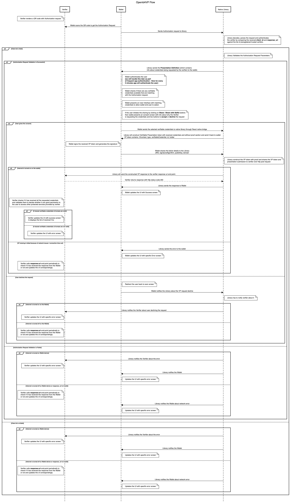

# INJI-OpenID4VP

Description: Implementation of OpenID for Verifiable Presentations - draft 21 specifications in Kotlin

# Supported features

| Feature                                                    | Supported values                                                                                                                                                                                                                                                                                                                                                   |
|------------------------------------------------------------|--------------------------------------------------------------------------------------------------------------------------------------------------------------------------------------------------------------------------------------------------------------------------------------------------------------------------------------------------------------------|
| Device flow                                                | cross device flow                                                                                                                                                                                                                                                                                                                                                  |
| Client id scheme                                           | `pre-registered`, `redirect_uri`, `did`                                                                                                                                                                                                                                                                                                                            |
| Signed authorization request verification algorithms       | Ed25519                                                                                                                                                                                                                                                                                                                                                            |
| Obtaining authorization request                            | By value, By reference ( via `request_uri` method)   _[Note: Authorization request by value is not supported for the did client ID scheme, as it requires a signed request. Instead, a Request URI should be used to fetch the signed authorization request ([reference](https://openid.net/specs/openid-4-verifiable-presentations-1_0-23.html#section-3.2))]_ |
| Obtaining presentation definition in authorization request | By value, By reference (via `presentation_definition_uri`)                                                                                                                                                                                                                                                                                                         |
|  Authorization Response content encryption algorithms      | `A256GCM`                                                                                                                                                                                                                                                                                                                                                          |
| Authorization Response key encryption algorithms           | `ECDH-ES`                                                                                                                                                                                                                                                                                                                                                          |
| Authorization Response mode                                | `direct_post`, `direct_post.jwt` (with encrypted & unsigned responses)                                                                                                                                                                                                                                                                                             |
| Authorization Response type                                | `vp_token`                                                                                                                                                                                                                                                                                                                                                         |

## Specifications supported
- The implementation follows OpenID for Verifiable Presentations - draft 23. [Specification](https://openid.net/specs/openid-4-verifiable-presentations-1_0-23.html).
- Below are the fields we expect in the authorization request based on the client id scheme,
    - Client_id_scheme is **_pre-registered_**
        * client_id
        * client_id_scheme
        * presentation_definition/presentation_definition_uri
        * response_type
        * response_mode
        * nonce
        * state
        * response_uri
        * client_metadata (Optional)

    - Client_id_scheme is **_redirect_uri_**
        * client_id
        * client_id_scheme
        * presentation_definition/presentation_definition_uri
        * response_type
        * nonce
        * state
        * redirect_uri
        * client_metadata (Optional)

    - **_Request Uri_** is also supported as part of this version.
    - When request_uri is passed as part of the authorization request, below are the fields we expect in the authorization request,
        * client_id
        * client_id_scheme
        * request_uri
        * request_uri_method

    - The request uri can return either a jwt token/encoded if it is a jwt the signature is verified as mentioned in the specification.
    - The client id and client id scheme from the authorization request and the client id and client id scheme received from the response of the request uri should be same.
- VC format supported is Ldp Vc as of now.

**Note** : The pre-registered client id scheme validation can be toggled on/off based on the optional boolean which you can pass to the authenticateVerifier methods shouldValidateClient parameter. This is false by default.
## Functionalities

- Decode and parse the Verifier's encoded Authorization Request received from the Wallet.
- Authenticates the Verifier using the received clientId and returns the valid Presentation Definition to the Wallet.
- Receives the list of verifiable credentials(VC's) from the Wallet which are selected by the Wallet end user based on the credentials requested as part of Verifier Authorization request.
- Constructs the verifiable presentation and send it to wallet for generating Json Web Signature (JWS).
- Receives the signed Verifiable presentation and sends a POST request with generated vp_token and presentation_submission to the Verifier response_uri endpoint.

**Note** : Fetching Verifiable Credentials by passing [Scope](https://openid.net/specs/openid-4-verifiable-presentations-1_0.html#name-using-scope-parameter-to-re) param in Authorization Request is not supported by this library.

## Library implementations available in:

This library is officially supported and available in both Kotlin and Swift, ensuring seamless integration across Android and iOS platforms. The references for both implementations are provided below:
* [Kotlin](./kotlin/openID4VP/README.md)
* [Swift](https://github.com/mosip/inji-openid4vp-ios-swift)

##### The below diagram shows the interactions between Wallet, Verifier and OpenID4VP library

<figure><figcaption></figcaption></figure>