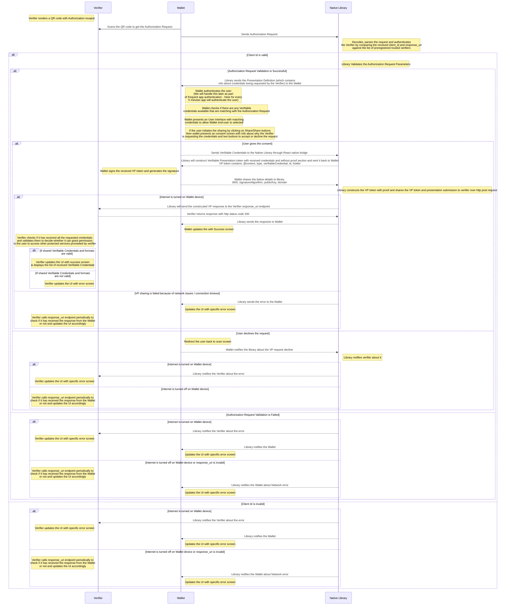

# The below diagram shows the interactions between Wallet, Verifier and OpenID4VP library

```mermaid
sequenceDiagram
    participant Verifier
    participant Wallet
    participant Native Library

    Note left of Verifier: Verifier renders a QR code with Authorization reuqest
    
    Wallet->>Verifier: Scans the QR code to get the Authorization Request
    Wallet->>Native Library: Sends Authorization Request
    Note right of Native Library: Decodes, parses the request and authenticates<br/>the Verifier by comparing the received client_id and response_uri<br/>against the list of preregistered trusted verifiers

    alt Client Id is valid
        Note right of Native Library: Library Validates the Authorization Request Parameters
        alt Authorization Request Validation is Successful
            Native Library->>Wallet: Library sends the Presentation Definition (which contains<br/> info about credentials being requested by the Verifier) to the Wallet
            Note right of Wallet: Wallet authenticates the user <br/>(We will handle this later as part<br/>of frequent app authentication - Here for every<br/>5 minutes app will authenticate the user)
            Note right of Wallet: Wallet checks if there are any Verifiable<br/> credentials available that are matching with the Authorization Request
            Note right of Wallet: Wallet presents an User interface with matching<br/> credentials to allow Wallet end-user to selected
            Note right of Wallet: If the user initiates the sharing by clicking on Share/Share buttons<br/>then wallet presents an consent screen with info about why the Verifier<br/> is requesting the credentials and two buttons to accept or decline the request
            alt User gives the consent
                Wallet-->>Native Library: Sends Verifiable Credentials to the Native Library through React native bridge
                Native Library-->>Wallet: Library will construct Verifiable Presentation token with received credentials and without proof section and sent it back to Wallet<br>VP token contains: @context, type, verifiableCredential, id, holder
                Note left of Wallet: Wallet signs the received VP token and generates the signature
                Wallet-->>Native Library: Wallet shares the below details to library<br>JWS, signatureAlgorithm, publicKey, domain
                Note right of Native Library: Library constructs the VP token with proof and shares the VP token and presentation submission to verifier over http post request 
                alt Internet is turned on Wallet device
                    Native Library-->>Verifier: Library will send the constrcuted VP response to the Verifier response_uri endpoint
                    Verifier-->>Native Library: Verifier returns response with http status code 200
                    Native Library-->>Wallet: Library sends the resposne to Wallet
                    Note right of Wallet: Wallet updates the with Success screen
                    Note left of Verifier: Verifier checks if it has received all the requested credentials<br/> and validates them to decide whether it can grant permission<br/> to the user to access other protected services provieded by verifier
                    alt If shared Verifiable Credentials and formats are valid
                        Note left of Verifier: Verifier updates the UI with success screen<br/> & displays the list of received Verifiable Credentials
                    else If shared Verifiable Credentials and formats are not valid
                        Note left of Verifier: Verifier updates the UI with error screen
                    end
                else VP sharing is failed because of network issues / connection timeout
                    Native Library-->>Wallet: Library sends the error to the Wallet
                    Note right of Wallet: Updates the UI with specific error screen
                    Note left of Verifier: Verifier calls response_uri endpoint periodically to<br/> check if it has received the response from the Wallet<br/> or not and updates the UI accordingly
                end
            else User declines the request
                Note right of Wallet: Redirect the user back to scan screen
                Wallet-->>Native Library: Wallet notifies the library about the VP request decline
                Note right of Native Library: Library notifies verifier about it
                alt Internet is turned on Wallet device
                    Native Library-->>Verifier: Library notifies the Verifier about the error
                    Note left of Verifier: Verifier updates the UI with specific error screen
                else Internet is turned off on Wallet device
                    Note left of Verifier: Verifier calls response_uri endpoint periodically to<br/> check if it has received the response from the Wallet<br/> or not and updates the UI accordingly
                end
            end
        else Authorization Request Validation is Failed
            alt Internet is turned on Wallet device
                Native Library-->>Verifier: Library notifies the Verifier about the error
                Note left of Verifier: Verifier updates the UI with specific error screen
                Native Library-->>Wallet: Library notifies the Wallet
            Note right of Wallet: Updates the UI with specific error screen
            else Internet is turned off on Wallet device or response_uri is invalid
                Note left of Verifier: Verifier calls response_uri endpoint periodically to<br/> check if it has received the response from the Wallet<br/> or not and updates the UI accordingly
                Native Library-->>Wallet: Library notifies the Wallet about Network error
                Note right of Wallet: Updates the UI with specific error screen
            end
        end
    else Client Id is invalid
        alt Internet is turned on Wallet device
            Native Library-->>Verifier: Library notifies the Verifier about the error
            Note left of Verifier: Verifier updates the UI with specific error screen
            Native Library-->>Wallet: Library notifies the Wallet
            Note right of Wallet: Updates the UI with specific error screen
        else Internet is turned off on Wallet device or response_uri is invalid
            Note left of Verifier: Verifier calls response_uri endpoint periodically to<br/> check if it has received the response from the Wallet<br/> or not and updates the UI accordingly
            Native Library-->>Wallet: Library notifies the Wallet about Network error
            Note right of Wallet: Updates the UI with specific error screen
        end
    end
```