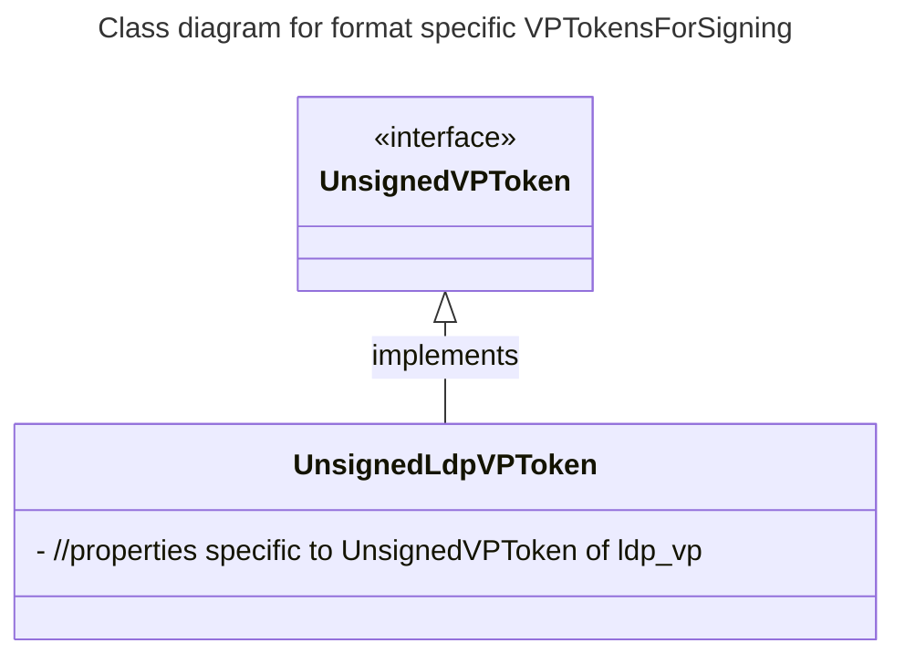
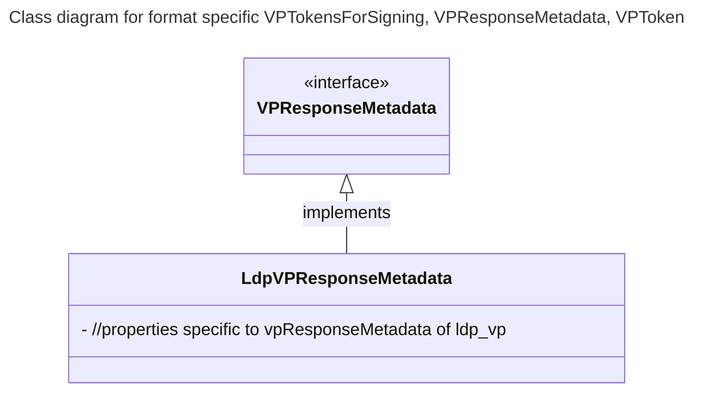
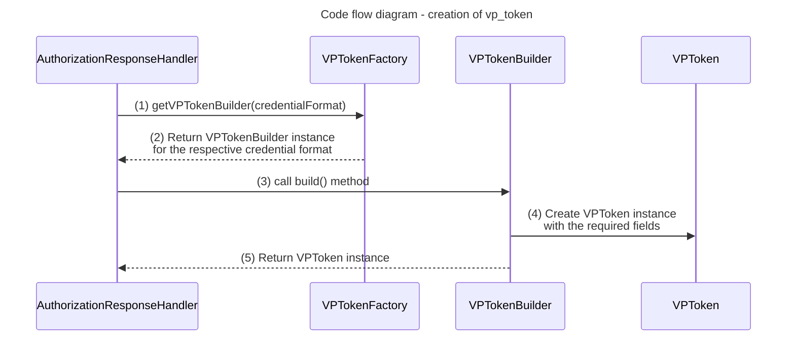
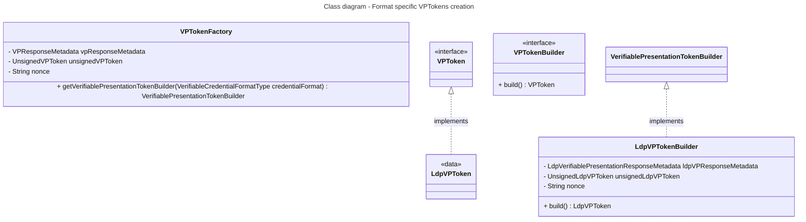

# 2. support-for-multiple-credential-format-vp-token-creation

Date: 2025-03-19

## People involved
- Swait Goel
- Alka Prasad
- Adityan Kannan
- Kiruthika 

## Status

Accepted

## Context

The library should be able to create vp_tokens for different credential formats but the methods exposed or the internal level code design is not supporting this feature. The current implementation is tightly coupled with the specific credential format and the vp_token creation logic is not abstracted out. This makes it difficult to add support for new credential formats.

## Decision

To combat the issue, we will be restructuring the exposed public methods and internal level code design to support multiple credential formats. The following changes will be made:

1. constructVerifiablePresentationToken method

**previous:**

```kotlin
constructVerifiablePresentationToken(verifiableCredentials: Map<String, List<String>>): String
```
- accepts an input of type `Map<String, List<String>>` where the key is the input_descriptor id and the value is the list of user selected verifiable credentials 
- returns a string which is the JSON representation of the UnsignedVPToken
- Issues
  - Unable to find the credential format of the verifiable credential to construct the vp_token specific to the credential format

**Changes introduced:** 

```kotlin
constructVerifiablePresentationToken(verifiableCredentials: Map<String, Map<FormatType, List<Any>>>): VPTokensForSigning
```
- accepts an input of type `Map<String, Map<FormatType, List<Any>>>` where the key is the input_descriptor id and the value is the map of credential format and the list of user selected verifiable credentials
- returns an instance of VPTokensForSigning which contains required details to sign to be signed by the user for the creation of vp_token
- This overcomes the issue of finding the credential format of the verifiable credential to construct the vp_token specific to the credential format
- Code design changes introduced
  - Introduced a new interface `UnsignedVPToken` which will be implemented by the format specific `UnsignedVPToken` classes for instance `UnsignedLdpVPToken` (diagram mentioned below)


2. shareVerifiablePresentation method

**previous:**

```kotlin
shareVerifiablePresentation(vpResponseMetadata: VPResponseMetadata): String
```
- accepts an input of type VPResponseMetadata which is specific to LdpVp format
- returns a string corresponding to the response of the verifier's authorization response submission response body
- Issues
  - VPResponseMetadata is specific to LdpVp format and the method signature is not supporting the response metadata of other credential formats

**new**

```kotlin
shareVerifiablePresentation(vpResponsesMetadata: VPResponsesMetadata) : String
//where
typealias VPResponsesMetadata = Map<FormatType, VPResponseMetadata>
```
- accepts an input of type `Map<FormatType, VPResponseMetadata>` where the key is the credential format type and the value is the response metadata specific to the credential format.
- returns a string corresponding to the response of the verifier's authorization response submission response body
- This overcomes the issue of the method signature not supporting the response metadata of other credential formats and extensibility for other credential format VPToken creation
- Code design changes introduced
  - Introduced a new interface `VPResponseMetadata` which will be implemented by the format specific `VPResponseMetadata` classes for instance `LdpVPResponseMetadata` (diagram mentioned below)

- Internally code changes are also made specific to VPToken creation for different credential formats

Class diagrams of the design changes introduced


## Consequences

### Pros
- Extensibility to support multiple credential formats for vp_token creation is easier relatively
- Any new credential format can be supported by implementing the `UnsignedVPToken` and `VPResponseMetadata` interfaces

### Cons
- Consumers will be required to adapt the new changes as it will be included as a breaking change
