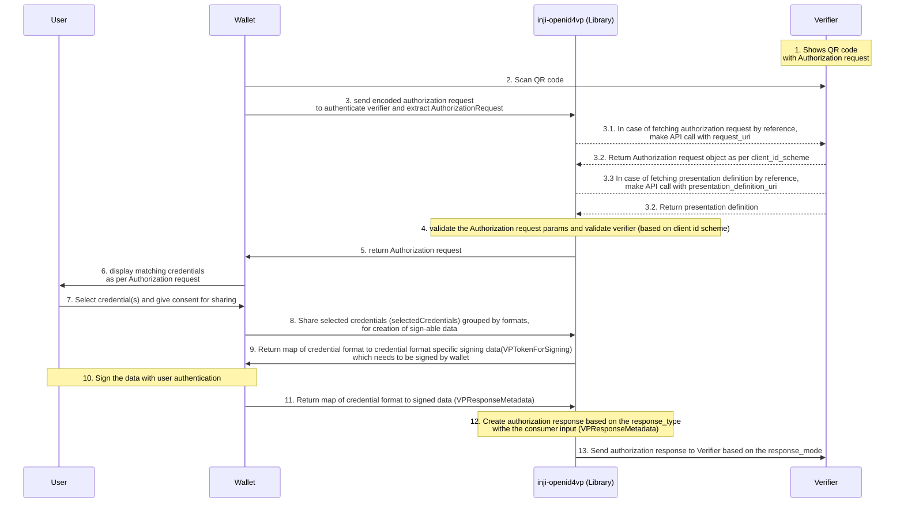

# INJI-OpenID4VP

Description: Implementation of OpenID for Verifiable Presentations - draft 23 specifications in Kotlin


## Specifications supported
- The implementation follows OpenID for Verifiable Presentations - draft 23. [Specification](https://openid.net/specs/openid-4-verifiable-presentations-1_0-21.html).
- Below are the fields we expect in the authorization request based on the client id scheme,
    - Client_id_scheme is **_pre-registered_**
        * client_id
        * client_id_scheme
        * presentation_definition/presentation_definition_uri
        * response_type
        * response_mode
        * nonce
        * state
        * response_uri
        * client_metadata (Optional)

    - Client_id_scheme is **_redirect_uri_**
        * client_id
        * client_id_scheme
        * presentation_definition/presentation_definition_uri
        * response_type
        * nonce
        * state
        * redirect_uri
        * client_metadata (Optional)

    - **_Request Uri_** is also supported as part of this version.
    - When request_uri is passed as part of the authorization request, below are the fields we expect in the authorization request,
        * client_id
        * client_id_scheme
        * request_uri
        * request_uri_method

    - The request uri can return either a jwt token/encoded if it is a jwt the signature is verified as mentioned in the specification.
    - The client id and client id scheme from the authorization request and the client id and client id scheme received from the response of the request uri should be same.
- VC format supported is Ldp Vc as of now.

**Note** : The pre-registered client id scheme validation can be toggled on/off based on the optional boolean which you can pass to the authenticateVerifier methods shouldValidateClient parameter. This is false by default.
## Functionalities

- Decode and parse the Verifier's encoded Authorization Request received from the Wallet.
- Authenticates the Verifier using the received clientId and returns the valid Presentation Definition to the Wallet.
- Receives the list of verifiable credentials(VC's) from the Wallet which are selected by the Wallet end user based on the credentials requested as part of Verifier Authorization request.
- Constructs the verifiable presentation and send it to wallet for generating Json Web Signature (JWS).
- Receives the signed Verifiable presentation and sends a POST request with generated vp_token and presentation_submission to the Verifier response_uri endpoint.

**Note** : Fetching Verifiable Credentials by passing [Scope](https://openid.net/specs/openid-4-verifiable-presentations-1_0.html#name-using-scope-parameter-to-re) param in Authorization Request is not supported by this library. 

## Supported Features

### Authorization response creation for VP formats
- **ldp_vp** – Supports the creation of authorization responses for Linked Data Proof Verifiable Presentations.

### Fetching of Authorization request

- **By Reference** – Retrieved via request_uri.
- **By Value** – Directly included in the request.

#### Response Modes

The following response mode(s) are supported,

- **direct_post** – The response is sent directly to the Verifier via an HTTP POST.

#### Client ID Schemes

Supported client ID schemes include

- **pre-registered** – The client ID is pre-registered with the verifier.
- **did** – A Decentralized Identifier (DID) serves as the client ID, and the authorization request is a signed JWT.
- **redirect_uri** – The client ID is inferred from a pre-registered redirect URI.

#### Response Types

Supported response types:

- **vp_token** – The response contains a Verifiable Presentation token along with presentation submission

### Sequence diagram - Cross device flow




## Installation

Snapshot builds are available - 

```groovy
implementation "io.mosip:inji-openid4vp:0.1.0-SNAPSHOT"
```

## Create instance of OpenID4VP library to invoke it's methods

```kotlin
openID4VP = OpenID4VP(traceabilityId = "test-OpenID4VP")
```

## APIs

### authenticateVerifier
- Receives a list of trusted verifiers & Verifier's encoded Authorization request from consumer app(mobile wallet).
- Decodes and parses the qr code data. Checks if the data contains request_uri or contains the entire Authorization request data entirely.
- Constructs the Authorization request object based on the client_id_scheme.
- Takes an optional boolean to toggle the client validation.
- Returns the validated Authorization request object.

```kotlin
 val authenticationResponse = openID4VP.authenticateVerifier(
    encodedAuthorizationRequest = encodedAuthorizationRequest,
    trustedVerifiers = trustedVerifiers,
    shouldValidateClient = shouldValidateClient
)
```

###### Parameters

| Name                         | Type           | Description                                                                          |
|------------------------------|----------------|--------------------------------------------------------------------------------------|
| encodedAuthenticationRequest | String         | Base64 encoded string containing the Verifier's authorization request                |
| trustedVerifiers             | List<Verifier> | A list of trusted Verifier objects each containing a clientId and a responseUri list |
| shouldValidateClient         | Bool?          | Optional Boolean to toggle client validation for pre-registered client id scheme     |

###### Sample usage

```kotlin
val encodedAuthorizationRequest = "OPENID4VP://authorize?cmVzcG9uc2V..."
val trustedVerifiers: List<Verifier> = listOf(
     Verifier(
        "mock-client", listOf(
            "https://mock-verifier.com/responseUri"
        )
    )
)
val authenticationResponse = openID4VP.authenticateVerifier(
    encodedAuthorizationRequest = encodedAuthorizationRequest,
    trustedVerifiers = trustedVerifiers,
    shouldValidateClient = true
)
```

###### Exceptions

**Exceptions**

1. DecodingException is thrown when there is an issue while decoding the Authorization Request
2. InvalidQueryParams exception is thrown if
   * query params are not present in the Request
   * there is an issue while extracting the params
   * both presentation_definition and presentation_definition_uri are present in Request
   * both presentation_definition and presentation_definition_uri are not present in Request
3. MissingInput exception is thrown if any of required params are not present in Request
4. InvalidInput exception is thrown if any of required params value is empty or null
5. InvalidVerifierClientID exception is thrown if the received request client_iD & response_uri are not matching with any of the trusted verifiers
6. JWTVerification exception is thrown if there is any error in extracting public key, kid or signature verification failure.

This method will also notify the Verifier about the error by sending it to the response_uri endpoint over http post request. If response_uri is invalid and validation failed then Verifier won't be able to know about it. 

### constructVerifiablePresentationToken
- Receives a map of input_descriptor id & list of verifiable credentials inclusive of credential format for each input_descriptor that are selected by the end-user.
- Creates a vp_token without proof using received input_descriptor IDs and verifiable credentials, then returns its string representation to consumer app(mobile wallet) for signing it.

```kotlin
    val vpTokenWithoutProof = openID4VP.constructVerifiablePresentationToken(verifiableCredentials: Map<String, List<String>>)
```

###### Parameters

| Name                   | Type                              | Description                                                                                                                                                                           |
|------------------------|-----------------------------------|---------------------------------------------------------------------------------------------------------------------------------------------------------------------------------------|
| verifiableCredentials  | Map<String,Map<String,List<Any>>> | A Map which contains input descriptor id as key and corresponding matching Verifiable Credentials serves as value. The verifiable credentials will be grouped using credential format |

###### Sample usage

```kotlin
val verifiableCredentials = mapOf(
    "input_descriptor1" to mapOf(
        "ldp_vc" to listOf("VC1","VC2")
    )
)
val vpTokenWithoutProof = openID4VP.constructVerifiablePresentationToken(
    verifiableCredentials = verifiableCredentials
)
```
###### Exceptions

1. JsonEncodingFailed exception is thrown if there is any issue while serializing the vp_token without proof.

This method will also notify the Verifier about the error by sending it to the response_uri endpoint over http post request. If response_uri is invalid and validation failed then Verifier won't be able to know about it.

### shareVerifiablePresentation
- This function constructs a vp_token with proof using received VPResponseMetadata, then sends it and the presentation_submission to the Verifier via a HTTP POST request.
- Returns the response back to the consumer app(mobile app) saying whether it has received the shared Verifiable Credentials or not.

```kotlin
    val response = openID4VP.shareVerifiablePresentation(vpResponseMetadata = vpResponsesMetadata)
```

###### Parameters

| Name                | Type                | Description                                                                             | Sample                                                                                                                                                                                   |
|---------------------|---------------------|-----------------------------------------------------------------------------------------|------------------------------------------------------------------------------------------------------------------------------------------------------------------------------------------|
| vpResponseMetadata  | VPResponseMetadata  | This contains domain & proof details such as jws, signatureAlgorithm, publicKey, domain | `mapOf("ldp_vc" to LdpVPResponseMetadata(jws = "eyJiweyrtwegrfwwaBKCGSwxjpa5suaMtgnQ",signatureAlgorithm = "RsaSignature2018",publicKey = "publicKey",domain = "https://domain.net")"))` |


###### Sample usage 

```kotlin
val vpResponsesMetadata: Map<String, VPResponseMetadata> = mapOf(
    "ldp_vc" to LdpVPResponseMetadata(
        jws = "eyJiweyrtwegrfwwaBKCGSwxjpa5suaMtgnQ",
        signatureAlgorithm = "RsaSignature2018",
        publicKey = publicKey,
        domain = "https://123",
    )
)
val result = openID4VP.shareVerifiablePresentation(
    vpResponseMetadata = vpResponsesMetadata
)
```

###### Exceptions

1. JsonEncodingFailed exception is thrown if there is any issue while serializing the generating vp_token or presentation_submission class instances.
2. InterruptedIOException is thrown if the connection is timed out when network call is made.
3. NetworkRequestFailed exception is thrown when there is any other exception occurred when sending the response over http post request.

This method will also notify the Verifier about the error by sending it to the response_uri endpoint over http post request. If response_uri is invalid and validation failed then Verifier won't be able to know about it.

### sendErrorToVerifier
- Receives an exception and sends it's message to the Verifier via an HTTP POST request.

```kotlin
 openID4VP.sendErrorToVerifier(exception: Exception)
```

###### Parameters

| Name      | Type      | Description                        | Sample                           |
|-----------|-----------|------------------------------------|----------------------------------|
| exception | Exception | This contains the exception object | `Exception("exception message")` |


###### Exceptions

1. InterruptedIOException is thrown if the connection is timed out when network call is made.
2. NetworkRequestFailed exception is thrown when there is any other exception occurred when sending the response over http post request.

##### The below diagram shows the interactions between Wallet, Verifier and OpenID4VP library

<figure><figcaption></figcaption></figure>

### Note

As per OpenID4VP draft 23
